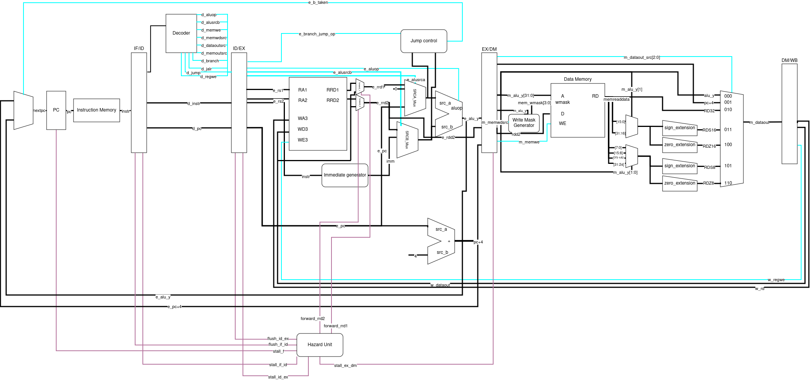

# Zeptron - RISC-V CPU
## Overview
Zeptron is a [RISC-V](https://riscv.org/) compatible CPU with 5 pipeline stages. It is implemented in SystemVerilog and 
verified using [riscof](https://riscof.readthedocs.io/en/stable/).
The scripts use [Modelsim](https://www.intel.com/content/www/us/en/software-kit/750666/modelsim-intel-fpgas-standard-edition-software-version-20-1-1.html) to
simulate the architectual tests supplied by riscof. The verification is done in a seperated repository [Zeptron-riscof](https://github.com/zDox/Zeptron-riscof). 
The CPU supports the rv32i instruction set architecture.

## Implementation Details
### Test Utils Module
- Memory mapped at 0x100
- 0x100 address begin signature
- 0x104 address end signature
- 0x108 address if non zero -> dump signature and quit sim

### Memory Model
- 0x000 - 0x100 not in Use
- 0x100 - 0x112 Test utilities module
- 0x112 - 0x200 not in Use
- 0x200 - 0xXXX code segment
